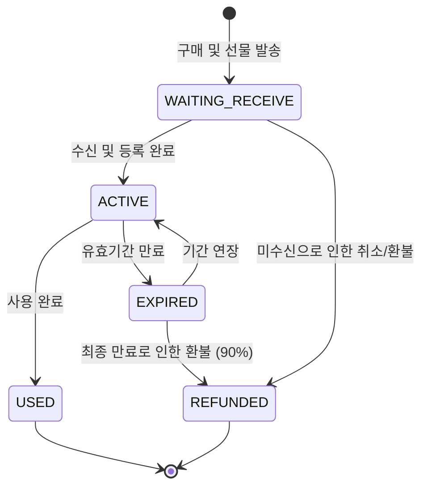

# 카카오톡 데이터베이스 최종 설계 및 검증 보고서 (database.md)

이 문서는 카카오톡 기능 사양 및 도메인 과제 정의를 기반으로, 데이터베이스 아키텍처 오케스트레이터 에이전트(`db_verifier`)와 하위 전문 에이전트들이 협업하여 검증하고 최적화한 최종 데이터베이스 스키마 및 설계 리포트입니다.

---

## 1. 분야별 진단 결과

### 1.1. 정규화 및 모델링 진단 (`db_normalizer`)
- **1:1 프로필 테이블 분리**: `user`와 `profile` 테이블을 1:1 관계로 분리하여 데이터 크기가 크고 수정이 잦은 프로필 정보를 인증/세션 정보와 격리했습니다. 이는 버퍼 풀 효율성을 극대화하여 성능 최적화에 기여합니다.
- **이모티콘 마스터 테이블 정규화 (3NF)**: 기존의 단일 `emoticons` 테이블에서 발생하던 이행적 함수 종속성을 제거하기 위해, 패키지 마스터 정보를 갖는 `emoticon_pack`을 별도 분리하여 3차 정규화를 만족시켰습니다.
- **안 읽은 카운트 감산 락(Lock) 해결**: 단체방에서 사용자들이 대화를 읽을 때마다 개별 메시지의 안 읽은 숫자를 물리적으로 업데이트하던 방식은 병목과 레코드 락을 발생시킵니다. 범위 기반의 `last_read_message_id`를 추적하는 구조로 변환하여 락을 제거했습니다.
- **참조 무결성 및 법적 보존 의무**: 기프티콘(`gift_coupon`)이나 공유 일정 등은 회원 탈퇴 시 `ON DELETE CASCADE`에 의해 강제 파기될 위험이 있습니다. 전자상거래법 상의 거래 기록 5년 보존 의무를 충족하기 위해 `ON DELETE RESTRICT`를 지정하고 소프트 딜리트 정책을 결합했습니다.
- **오픈채팅 영구 차단 구현**: 오픈프로필의 익명성을 해치지 않고 실제 가입 계정(`user_id`)을 매핑하여 재입장을 방지할 수 있도록 `open_chat_blacklist` 교차 테이블을 추가했습니다.
- **탈퇴 회원의 재가입 충돌 해결**: 탈퇴 유저 정보 보존 시 전화번호(`phone_number`) 유니크 제약조건이 충돌하는 문제를 방지하기 위해, 탈퇴 시점에 전화번호 필드 뒤에 타임스탬프를 병합하는 동적 마스킹 규칙을 도입했습니다.

### 1.2. 네이밍 컨벤션 진단 (`db_namer`)
- **스네이크 케이스(snake_case) 통일**: MySQL 구동 환경(OS)에 따른 쿼리 오류 방지를 위해 대소문자가 섞인 네이밍들을 소문자 스네이크 케이스로 일관되게 규정했습니다.
- **단수형 테이블명 준수**: 객체 지향 엔티티 모델과의 직관성을 맞추기 위해 테이블명을 복수형에서 단수형(`user`, `chat_room`, `message` 등)으로 통일했습니다.
- **시간 속성 및 단위 명확화**: 시간 데이터는 접미사 `_at`(`created_at`, `expires_at` 등)을 붙이고, 파일 크기 등 수치 속성은 단위(`file_size_bytes`)를 컬럼명에 기재해 직관성을 높였습니다.

### 1.3. 성능 및 인덱스 분석 (`db_perf_analyzer`)
- **조회/정렬 최적화 인덱스 구성**:
  - `friendship`: 역방향 친구 조회를 위한 `(friend_user_id, user_id)` 인덱스 추가.
  - `message`: 페이징 성능 극대화를 위한 `(chat_room_id, id DESC)` 복합 인덱스 추가.
  - `chat_room_setting`: 상단 고정 목록 최신순 조회를 위한 `(user_id, is_pinned DESC, pin_order ASC)` 복합 인덱스 추가.
- **대용량 메시지 파티셔닝**: `message` 및 `business_message` 테이블은 시간이 지남에 따라 데이터가 무한히 증식하므로, 복합 기본키에 `created_at`/`sent_at`을 엮어 월 단위의 **레인지 파티셔닝(Range Partitioning)**을 적용했습니다.

---

## 2. 개선 대안 및 트레이드오프 분석

### 2.1. 안 읽은 메시지 수(Unread Count) 계산 대안
- **대안 1 (RDBMS 범위 계산 - 채택)**: `message_read` 테이블의 `last_read_message_id` 범위를 조회하여 동적으로 카운팅합니다. 정합성이 뛰어나고 추가 인프라가 필요 없습니다.
- **대안 2 (Redis 캐싱 결합)**: 메시지 발송 시 Redis의 Sorted Set 등을 활용해 안 읽은 카운트를 캐싱하고 비동기로 RDB에 싱크합니다. 성능은 매우 뛰어나나 인프라 복잡도가 올라갑니다.
- **종합 권장**: 기본적으로 **대안 1**을 채택하고, 트래픽 임계점이 높은 대규모 오픈채팅방에 한해 **대안 2**를 하이브리드로 결합하는 것을 권장합니다.

### 2.2. 메시지 수정 히스토리 보존 대안
- **대안 1 (이력 테이블 격리 - 채택)**: 메인 `message` 테이블은 항상 최종 수정된 메시지만 유지하고, 수정 이력은 `message_edit_history` 테이블에 분리 적재합니다. 대화 조회 쿼리가 단순화되고 디스크 성능이 최상으로 유지됩니다.
- **대안 2 (단일 테이블 내 버전 관리)**: 동일 메시지에 대해 `version` 컬럼을 엮어 다중 Row로 저장합니다. 쿼리 시 서브쿼리 조인이 필수적이어서 대용량 환경에서 비효율적입니다.

---

## 3. 도메인 설계 다이어그램

### 3.1. ERD (Entity Relationship Diagram)

```mermaid
erDiagram
    user {
        BIGINT id PK "AUTO_INCREMENT"
        VARCHAR phone_number UK "국가코드 포함"
        VARCHAR email UK
        DATE birth_date "생년월일"
        VARCHAR status "ACTIVE, PENDING_DELETE, BLOCKED"
        TIMESTAMP created_at
        TIMESTAMP updated_at
    }
    profile {
        BIGINT user_id PK, FK "user.id"
        VARCHAR nickname
        VARCHAR profile_image_url
        VARCHAR profile_thumbnail_url
        VARCHAR background_image_url
        VARCHAR status_message
        TIMESTAMP profile_changed_at "프로필 변경시각"
        TIMESTAMP created_at
        TIMESTAMP updated_at
    }
    user_device {
        BIGINT user_id PK, FK "user.id"
        VARCHAR device_uuid
        VARCHAR os_type
        VARCHAR session_token
        TIMESTAMP last_login_at
    }
    user_backup {
        BIGINT id PK "AUTO_INCREMENT"
        BIGINT user_id FK "user.id"
        VARCHAR backup_data_url
        VARCHAR auth_key_hash
        TIMESTAMP expires_at "14일 유효"
        TIMESTAMP created_at
    }
    friendship {
        BIGINT user_id PK, FK "user.id"
        BIGINT friend_user_id PK, FK "user.id"
        VARCHAR status "NORMAL, FAVORITE, HIDDEN, BLOCKED_MSG, BLOCKED_ALL"
        TINYINT is_favorite "0 or 1"
        TIMESTAMP created_at
        TIMESTAMP updated_at
    }
    multi_profile {
        BIGINT id PK "AUTO_INCREMENT"
        BIGINT user_id FK "user.id"
        VARCHAR nickname
        VARCHAR profile_image_url
        VARCHAR profile_thumbnail_url
        VARCHAR background_image_url
        VARCHAR status_message
        TIMESTAMP created_at
        TIMESTAMP updated_at
    }
    multi_profile_friend {
        BIGINT id PK "AUTO_INCREMENT"
        BIGINT multi_profile_id FK "multi_profile.id"
        BIGINT friend_user_id FK "user.id"
        TIMESTAMP created_at
    }
    chat_room {
        BIGINT id PK "AUTO_INCREMENT"
        VARCHAR type PK "ME, DOUBLE, GROUP, OPEN_DOUBLE, OPEN_GROUP"
        TIMESTAMP created_at
    }
    open_chat_room {
        BIGINT chat_room_id PK, FK "chat_room.id"
        VARCHAR chat_room_type FK "chat_room.type"
        BIGINT owner_user_id FK "user.id"
        VARCHAR passcode
        INT max_members_count
    }
    chat_room_member {
        BIGINT chat_room_id PK, FK "chat_room.id"
        BIGINT user_id PK, FK "user.id"
        VARCHAR nickname
        VARCHAR profile_image_url
        TIMESTAMP joined_at
        TIMESTAMP leaved_at
        TIMESTAMP cleared_at
        VARCHAR role "OWNER, MANAGER, MEMBER"
    }
    chat_room_setting {
        BIGINT chat_room_id PK, FK "chat_room.id"
        BIGINT user_id PK, FK "user.id"
        TINYINT is_alarm_on
        TINYINT is_pinned
        INT pin_order
        VARCHAR custom_background_url
        TINYINT is_input_locked
    }
    message {
        BIGINT id PK "AUTO_INCREMENT"
        BIGINT chat_room_id FK "chat_room.id"
        BIGINT sender_user_id FK "user.id"
        TEXT content
        VARCHAR type "TEXT, EMOTICON, MEDIA, SYSTEM, etc."
        BIGINT parent_message_id FK "message.id"
        TINYINT is_edited
        TIMESTAMP last_edited_at
        VARCHAR client_message_token
        TIMESTAMP created_at PK "Range Partition Key"
    }
    message_edit_history {
        BIGINT id PK "AUTO_INCREMENT"
        BIGINT message_id FK "message.id"
        TEXT original_content
        TIMESTAMP edited_at
    }
    message_read {
        BIGINT chat_room_id PK, FK "chat_room.id"
        BIGINT user_id PK, FK "user.id"
        BIGINT last_read_message_id
    }
    open_chat_blacklist {
        BIGINT id PK "AUTO_INCREMENT"
        BIGINT chat_room_id
        BIGINT blocked_user_id FK "user.id"
        TIMESTAMP created_at
    }
    emoticon_pack {
        BIGINT id PK "AUTO_INCREMENT"
        VARCHAR pack_name
        VARCHAR publisher
        TIMESTAMP created_at
    }
    emoticon {
        BIGINT id PK "AUTO_INCREMENT"
        VARCHAR type PK "DEFAULT, STORE, MINI"
        VARCHAR name
        TIMESTAMP created_at
    }
    store_emoticon {
        BIGINT emoticon_id PK, FK "emoticon.id"
        VARCHAR emoticon_type FK "emoticon.type"
        BIGINT emoticon_pack_id FK "emoticon_pack.id"
        DECIMAL price_amount
        VARCHAR image_url
        VARCHAR audio_url
    }
    mini_emoticon {
        BIGINT emoticon_id PK, FK "emoticon.id"
        VARCHAR emoticon_type FK "emoticon.type"
        VARCHAR mapping_code UK
        VARCHAR image_url
    }
    user_emoticon_license {
        BIGINT id PK "AUTO_INCREMENT"
        BIGINT user_id FK "user.id"
        BIGINT emoticon_id FK "emoticon.id"
        VARCHAR license_type "PURCHASE, SUBSCRIPTION"
        TIMESTAMP acquired_at
        TIMESTAMP expires_at
    }
    calendar_event {
        BIGINT id PK "AUTO_INCREMENT"
        BIGINT chat_room_id
        VARCHAR title
        TEXT description
        TIMESTAMP start_at
        TIMESTAMP end_at
        VARCHAR location
        BIGINT created_by_user_id FK "user.id"
        TIMESTAMP created_at
    }
    calendar_attendee {
        BIGINT calendar_event_id PK, FK "calendar_event.id"
        BIGINT user_id PK, FK "user.id"
        VARCHAR status "ACCEPTED, DECLINED, TENTATIVE"
    }
    media_file {
        BIGINT id PK "AUTO_INCREMENT"
        BIGINT message_id FK "message.id"
        VARCHAR file_type
        BIGINT file_size_bytes
        VARCHAR original_url
        VARCHAR thumbnail_url
        TIMESTAMP expires_at
        TIMESTAMP created_at
    }
    business_message {
        BIGINT id PK "AUTO_INCREMENT"
        BIGINT partner_id
        VARCHAR recipient_phone_number
        BIGINT template_id
        TIMESTAMP sent_at PK "Range Partition Key"
        VARCHAR delivery_status "SENT, DELIVERED, FAILED"
        VARCHAR delivery_carrier
        TIMESTAMP delivery_confirmed_at
    }
    gift_coupon {
        BIGINT id PK "AUTO_INCREMENT"
        VARCHAR coupon_code UK
        BIGINT sender_user_id FK "user.id"
        BIGINT receiver_user_id FK "user.id"
        BIGINT product_id
        VARCHAR status "WAITING_RECEIVE, ACTIVE, USED, etc."
        DECIMAL price_amount
        VARCHAR refund_recipient_role "SENDER, RECEIVER"
        TIMESTAMP created_at
        TIMESTAMP updated_at
    }
    gift_coupon_history {
        BIGINT id PK "AUTO_INCREMENT"
        BIGINT gift_coupon_id FK "gift_coupon.id"
        VARCHAR status_from
        VARCHAR status_to
        VARCHAR transaction_identifier
        TIMESTAMP changed_at
    }

    user ||--|| profile : has
    user ||--o| user_device : registers
    user ||--o{ user_backup : performs
    user ||--o{ friendship : has
    user ||--o{ multi_profile : defines
    multi_profile ||--o{ multi_profile_friend : applies
    user ||--o{ multi_profile_friend : target
    chat_room ||--o{ chat_room_member : participates
    user ||--o{ chat_room_member : "member of"
    chat_room ||--o| open_chat_room : "specialized as"
    user ||--o{ open_chat_room : owns
    chat_room ||--o{ chat_room_setting : applies
    user ||--o{ chat_room_setting : configures
    chat_room ||--o{ message : contains
    user ||--o{ message : sends
    message ||--o{ message_edit_history : edits
    chat_room ||--o{ message_read : reads
    user ||--o{ message_read : tracks
    chat_room ||--o{ open_chat_blacklist : bans
    user ||--o{ open_chat_blacklist : blocked
    emoticon_pack ||--o{ store_emoticon : groups
    emoticon ||--o| store_emoticon : "specialized as"
    emoticon ||--o| mini_emoticon : "specialized as"
    user ||--o{ user_emoticon_license : holds
    emoticon ||--o{ user_emoticon_license : licensed
    chat_room ||--o{ calendar_event : scheduled
    user ||--o{ calendar_event : schedules
    calendar_event ||--o{ calendar_attendee : invites
    user ||--o{ calendar_attendee : attends
    message ||--o{ media_file : uploads
    gift_coupon ||--o{ gift_coupon_history : changes
    user ||--o{ gift_coupon : purchases
    user ||--o{ gift_coupon : receives
```


### 3.2. 기프티콘 상태 전이 머신 (State Machine)


---

## 4. 최종 MySQL DDL 스키마

```sql
SET NAMES utf8mb4;

-- 1. 회원 및 세션/보안 테이블
CREATE TABLE `user` (
    `id` BIGINT AUTO_INCREMENT PRIMARY KEY,
    `phone_number` VARCHAR(50) NOT NULL UNIQUE,
    `email` VARCHAR(100) UNIQUE,
    `birth_date` DATE NULL, -- 생년월일 (연도 제외 필터링 대비)
    `status` VARCHAR(20) NOT NULL DEFAULT 'ACTIVE',
    `created_at` TIMESTAMP DEFAULT CURRENT_TIMESTAMP,
    `updated_at` TIMESTAMP DEFAULT CURRENT_TIMESTAMP ON UPDATE CURRENT_TIMESTAMP
) ENGINE=InnoDB DEFAULT CHARSET=utf8mb4 COLLATE=utf8mb4_unicode_ci;

CREATE TABLE `profile` (
    `user_id` BIGINT PRIMARY KEY,
    `nickname` VARCHAR(50) NOT NULL,
    `profile_image_url` VARCHAR(255),
    `profile_thumbnail_url` VARCHAR(255),
    `background_image_url` VARCHAR(255),
    `status_message` VARCHAR(255),
    `profile_changed_at` TIMESTAMP DEFAULT CURRENT_TIMESTAMP, -- 최근 프로필 업데이트 시각
    `created_at` TIMESTAMP DEFAULT CURRENT_TIMESTAMP,
    `updated_at` TIMESTAMP DEFAULT CURRENT_TIMESTAMP ON UPDATE CURRENT_TIMESTAMP,
    FOREIGN KEY (`user_id`) REFERENCES `user` (`id`) ON DELETE CASCADE
) ENGINE=InnoDB DEFAULT CHARSET=utf8mb4 COLLATE=utf8mb4_unicode_ci;

CREATE TABLE `user_device` (
    `user_id` BIGINT PRIMARY KEY,
    `device_uuid` VARCHAR(100) NOT NULL,
    `os_type` VARCHAR(20) NOT NULL,
    `session_token` VARCHAR(255) NOT NULL,
    `last_login_at` TIMESTAMP DEFAULT CURRENT_TIMESTAMP,
    FOREIGN KEY (`user_id`) REFERENCES `user` (`id`) ON DELETE CASCADE
) ENGINE=InnoDB DEFAULT CHARSET=utf8mb4 COLLATE=utf8mb4_unicode_ci;

CREATE TABLE `user_backup` (
    `id` BIGINT AUTO_INCREMENT PRIMARY KEY,
    `user_id` BIGINT NOT NULL,
    `backup_data_url` VARCHAR(255) NOT NULL,
    `auth_key_hash` VARCHAR(255) NOT NULL,
    `expires_at` TIMESTAMP NOT NULL,
    `created_at` TIMESTAMP DEFAULT CURRENT_TIMESTAMP,
    FOREIGN KEY (`user_id`) REFERENCES `user` (`id`) ON DELETE CASCADE
) ENGINE=InnoDB DEFAULT CHARSET=utf8mb4 COLLATE=utf8mb4_unicode_ci;

-- 2. 친구 및 멀티프로필 테이블
CREATE TABLE `friendship` (
    `user_id` BIGINT NOT NULL,
    `friend_user_id` BIGINT NOT NULL,
    `status` VARCHAR(20) NOT NULL DEFAULT 'NORMAL',
    `is_favorite` TINYINT(1) NOT NULL DEFAULT 0,
    `created_at` TIMESTAMP DEFAULT CURRENT_TIMESTAMP,
    `updated_at` TIMESTAMP DEFAULT CURRENT_TIMESTAMP ON UPDATE CURRENT_TIMESTAMP,
    PRIMARY KEY (`user_id`, `friend_user_id`),
    FOREIGN KEY (`user_id`) REFERENCES `user` (`id`) ON DELETE CASCADE,
    FOREIGN KEY (`friend_user_id`) REFERENCES `user` (`id`) ON DELETE CASCADE,
    INDEX `idx_friend_user` (`friend_user_id`, `user_id`),
    INDEX `idx_user_friend_favorite` (`user_id`, `status`, `is_favorite` DESC)
) ENGINE=InnoDB DEFAULT CHARSET=utf8mb4 COLLATE=utf8mb4_unicode_ci;

CREATE TABLE `multi_profile` (
    `id` BIGINT AUTO_INCREMENT PRIMARY KEY,
    `user_id` BIGINT NOT NULL,
    `nickname` VARCHAR(50) NOT NULL,
    `profile_image_url` VARCHAR(255),
    `profile_thumbnail_url` VARCHAR(255),
    `background_image_url` VARCHAR(255),
    `status_message` VARCHAR(255),
    `created_at` TIMESTAMP DEFAULT CURRENT_TIMESTAMP,
    `updated_at` TIMESTAMP DEFAULT CURRENT_TIMESTAMP ON UPDATE CURRENT_TIMESTAMP,
    FOREIGN KEY (`user_id`) REFERENCES `user` (`id`) ON DELETE CASCADE
) ENGINE=InnoDB DEFAULT CHARSET=utf8mb4 COLLATE=utf8mb4_unicode_ci;

CREATE TABLE `multi_profile_friend` (
    `id` BIGINT AUTO_INCREMENT PRIMARY KEY,
    `multi_profile_id` BIGINT NOT NULL,
    `friend_user_id` BIGINT NOT NULL,
    `created_at` TIMESTAMP DEFAULT CURRENT_TIMESTAMP,
    FOREIGN KEY (`multi_profile_id`) REFERENCES `multi_profile` (`id`) ON DELETE CASCADE,
    FOREIGN KEY (`friend_user_id`) REFERENCES `user` (`id`) ON DELETE CASCADE,
    UNIQUE KEY `uq_multi_profile_friend` (`multi_profile_id`, `friend_user_id`),
    INDEX `idx_friend_multi_profile` (`friend_user_id`, `multi_profile_id`)
) ENGINE=InnoDB DEFAULT CHARSET=utf8mb4 COLLATE=utf8mb4_unicode_ci;

-- 3. 채팅방 및 멤버 설정 테이블
CREATE TABLE `chat_room` (
    `id` BIGINT AUTO_INCREMENT,
    `type` VARCHAR(20) NOT NULL,
    `created_at` TIMESTAMP DEFAULT CURRENT_TIMESTAMP,
    PRIMARY KEY (`id`, `type`)
) ENGINE=InnoDB DEFAULT CHARSET=utf8mb4 COLLATE=utf8mb4_unicode_ci;

CREATE TABLE `open_chat_room` (
    `chat_room_id` BIGINT NOT NULL,
    `chat_room_type` VARCHAR(20) GENERATED ALWAYS AS ('OPEN_GROUP') STORED,
    `owner_user_id` BIGINT NOT NULL,
    `passcode` VARCHAR(50) NULL,
    `max_members_count` INT NOT NULL DEFAULT 100,
    PRIMARY KEY (`chat_room_id`),
    FOREIGN KEY (`chat_room_id`, `chat_room_type`) REFERENCES `chat_room` (`id`, `type`) ON DELETE CASCADE,
    FOREIGN KEY (`owner_user_id`) REFERENCES `user` (`id`) ON DELETE RESTRICT
) ENGINE=InnoDB DEFAULT CHARSET=utf8mb4 COLLATE=utf8mb4_unicode_ci;

CREATE TABLE `chat_room_member` (
    `chat_room_id` BIGINT NOT NULL,
    `user_id` BIGINT NOT NULL,
    `nickname` VARCHAR(50),
    `profile_image_url` VARCHAR(255),
    `joined_at` TIMESTAMP DEFAULT CURRENT_TIMESTAMP,
    `leaved_at` TIMESTAMP NULL,
    `cleared_at` TIMESTAMP NULL,
    `role` VARCHAR(20) NOT NULL DEFAULT 'MEMBER',
    PRIMARY KEY (`chat_room_id`, `user_id`),
    FOREIGN KEY (`user_id`) REFERENCES `user` (`id`) ON DELETE CASCADE,
    INDEX `idx_user_joined_rooms` (`user_id`, `joined_at` DESC)
) ENGINE=InnoDB DEFAULT CHARSET=utf8mb4 COLLATE=utf8mb4_unicode_ci;

CREATE TABLE `chat_room_setting` (
    `chat_room_id` BIGINT NOT NULL,
    `user_id` BIGINT NOT NULL,
    `is_alarm_on` TINYINT(1) NOT NULL DEFAULT 1,
    `is_pinned` TINYINT(1) NOT NULL DEFAULT 0,
    `pin_order` INT NOT NULL DEFAULT 0,
    `custom_background_url` VARCHAR(255),
    `is_input_locked` TINYINT(1) NOT NULL DEFAULT 0,
    PRIMARY KEY (`chat_room_id`, `user_id`),
    FOREIGN KEY (`user_id`) REFERENCES `user` (`id`) ON DELETE CASCADE,
    INDEX `idx_user_pin_order` (`user_id`, `is_pinned` DESC, `pin_order` ASC)
) ENGINE=InnoDB DEFAULT CHARSET=utf8mb4 COLLATE=utf8mb4_unicode_ci;

-- 4. 메시지 및 상호작용 테이블
CREATE TABLE `message` (
    `id` BIGINT AUTO_INCREMENT,
    `chat_room_id` BIGINT NOT NULL,
    `sender_user_id` BIGINT NULL,
    `content` TEXT,
    `type` VARCHAR(20) NOT NULL,
    `parent_message_id` BIGINT NULL,
    `is_edited` TINYINT(1) NOT NULL DEFAULT 0,
    `last_edited_at` TIMESTAMP NULL,
    `client_message_token` VARCHAR(100) NULL,
    `created_at` TIMESTAMP NOT NULL DEFAULT CURRENT_TIMESTAMP,
    PRIMARY KEY (`id`, `created_at`),
    CONSTRAINT `fk_message_parent` FOREIGN KEY (`parent_message_id`) REFERENCES `message` (`id`) ON DELETE SET NULL
) ENGINE=InnoDB DEFAULT CHARSET=utf8mb4 COLLATE=utf8mb4_unicode_ci
PARTITION BY RANGE (TO_DAYS(`created_at`)) (
    PARTITION p202606 VALUES LESS THAN (TO_DAYS('2026-07-01')),
    PARTITION p202607 VALUES LESS THAN (TO_DAYS('2026-08-01')),
    PARTITION p202608 VALUES LESS THAN (TO_DAYS('2026-09-01')),
    PARTITION p_max VALUES LESS THAN MAXVALUE
);

ALTER TABLE `message` ADD INDEX `idx_chatroom_message_paging` (`chat_room_id`, `id` DESC);

CREATE TABLE `message_edit_history` (
    `id` BIGINT AUTO_INCREMENT PRIMARY KEY,
    `message_id` BIGINT NOT NULL,
    `original_content` TEXT NOT NULL,
    `edited_at` TIMESTAMP DEFAULT CURRENT_TIMESTAMP,
    FOREIGN KEY (`message_id`) REFERENCES `message` (`id`) ON DELETE CASCADE
) ENGINE=InnoDB DEFAULT CHARSET=utf8mb4 COLLATE=utf8mb4_unicode_ci;

CREATE TABLE `message_read` (
    `chat_room_id` BIGINT NOT NULL,
    `user_id` BIGINT NOT NULL,
    `last_read_message_id` BIGINT NOT NULL,
    PRIMARY KEY (`chat_room_id`, `user_id`),
    FOREIGN KEY (`user_id`) REFERENCES `user` (`id`) ON DELETE CASCADE
) ENGINE=InnoDB DEFAULT CHARSET=utf8mb4 COLLATE=utf8mb4_unicode_ci;

CREATE TABLE `open_chat_blacklist` (
    `id` BIGINT AUTO_INCREMENT PRIMARY KEY,
    `chat_room_id` BIGINT NOT NULL,
    `blocked_user_id` BIGINT NOT NULL,
    `created_at` TIMESTAMP DEFAULT CURRENT_TIMESTAMP,
    FOREIGN KEY (`blocked_user_id`) REFERENCES `user` (`id`) ON DELETE CASCADE,
    UNIQUE KEY `uq_chat_room_blocked_user` (`chat_room_id`, `blocked_user_id`)
) ENGINE=InnoDB DEFAULT CHARSET=utf8mb4 COLLATE=utf8mb4_unicode_ci;

-- 5. 이모티콘 시스템 테이블
CREATE TABLE `emoticon_pack` (
    `id` BIGINT AUTO_INCREMENT PRIMARY KEY,
    `pack_name` VARCHAR(100) NOT NULL,
    `publisher` VARCHAR(100) NOT NULL,
    `created_at` TIMESTAMP DEFAULT CURRENT_TIMESTAMP
) ENGINE=InnoDB DEFAULT CHARSET=utf8mb4 COLLATE=utf8mb4_unicode_ci;

CREATE TABLE `emoticon` (
    `id` BIGINT AUTO_INCREMENT,
    `type` VARCHAR(20) NOT NULL,
    `name` VARCHAR(100) NOT NULL,
    `created_at` TIMESTAMP DEFAULT CURRENT_TIMESTAMP,
    PRIMARY KEY (`id`, `type`)
) ENGINE=InnoDB DEFAULT CHARSET=utf8mb4 COLLATE=utf8mb4_unicode_ci;

CREATE TABLE `store_emoticon` (
    `emoticon_id` BIGINT PRIMARY KEY,
    `emoticon_type` VARCHAR(20) GENERATED ALWAYS AS ('STORE') STORED,
    `emoticon_pack_id` BIGINT NOT NULL,
    `price_amount` DECIMAL(10, 2) NOT NULL,
    `image_url` VARCHAR(255) NOT NULL,
    `audio_url` VARCHAR(255) NULL,
    FOREIGN KEY (`emoticon_id`, `emoticon_type`) REFERENCES `emoticon` (`id`, `type`) ON DELETE CASCADE,
    FOREIGN KEY (`emoticon_pack_id`) REFERENCES `emoticon_pack` (`id`) ON DELETE CASCADE
) ENGINE=InnoDB DEFAULT CHARSET=utf8mb4 COLLATE=utf8mb4_unicode_ci;

CREATE TABLE `mini_emoticon` (
    `emoticon_id` BIGINT PRIMARY KEY,
    `emoticon_type` VARCHAR(20) GENERATED ALWAYS AS ('MINI') STORED,
    `mapping_code` VARCHAR(100) NOT NULL UNIQUE,
    `image_url` VARCHAR(255) NOT NULL,
    FOREIGN KEY (`emoticon_id`, `emoticon_type`) REFERENCES `emoticon` (`id`, `type`) ON DELETE CASCADE
) ENGINE=InnoDB DEFAULT CHARSET=utf8mb4 COLLATE=utf8mb4_unicode_ci;

CREATE TABLE `user_emoticon_license` (
    `id` BIGINT AUTO_INCREMENT PRIMARY KEY,
    `user_id` BIGINT NOT NULL,
    `emoticon_id` BIGINT NOT NULL,
    `license_type` VARCHAR(20) NOT NULL,
    `acquired_at` TIMESTAMP DEFAULT CURRENT_TIMESTAMP,
    `expires_at` TIMESTAMP NULL,
    FOREIGN KEY (`user_id`) REFERENCES `user` (`id`) ON DELETE CASCADE,
    FOREIGN KEY (`emoticon_id`) REFERENCES `emoticon` (`id`) ON DELETE CASCADE
) ENGINE=InnoDB DEFAULT CHARSET=utf8mb4 COLLATE=utf8mb4_unicode_ci;

-- 6. 부가 기능 및 미디어 테이블
CREATE TABLE `calendar_event` (
    `id` BIGINT AUTO_INCREMENT PRIMARY KEY,
    `chat_room_id` BIGINT NOT NULL,
    `title` VARCHAR(100) NOT NULL,
    `description` TEXT,
    `start_at` TIMESTAMP NOT NULL,
    `end_at` TIMESTAMP NOT NULL,
    `location` VARCHAR(255),
    `created_by_user_id` BIGINT NOT NULL,
    `created_at` TIMESTAMP DEFAULT CURRENT_TIMESTAMP,
    FOREIGN KEY (`created_by_user_id`) REFERENCES `user` (`id`) ON DELETE RESTRICT
) ENGINE=InnoDB DEFAULT CHARSET=utf8mb4 COLLATE=utf8mb4_unicode_ci;

CREATE TABLE `calendar_attendee` (
    `calendar_event_id` BIGINT NOT NULL,
    `user_id` BIGINT NOT NULL,
    `status` VARCHAR(20) NOT NULL DEFAULT 'TENTATIVE',
    PRIMARY KEY (`calendar_event_id`, `user_id`),
    FOREIGN KEY (`calendar_event_id`) REFERENCES `calendar_event` (`id`) ON DELETE CASCADE,
    FOREIGN KEY (`user_id`) REFERENCES `user` (`id`) ON DELETE CASCADE
) ENGINE=InnoDB DEFAULT CHARSET=utf8mb4 COLLATE=utf8mb4_unicode_ci;

CREATE TABLE `media_file` (
    `id` BIGINT AUTO_INCREMENT PRIMARY KEY,
    `message_id` BIGINT NOT NULL,
    `file_type` VARCHAR(20) NOT NULL,
    `file_size_bytes` BIGINT NOT NULL,
    `original_url` VARCHAR(255) NOT NULL,
    `thumbnail_url` VARCHAR(255),
    `expires_at` TIMESTAMP NULL,
    `created_at` TIMESTAMP DEFAULT CURRENT_TIMESTAMP,
    FOREIGN KEY (`message_id`) REFERENCES `message` (`id`) ON DELETE CASCADE
) ENGINE=InnoDB DEFAULT CHARSET=utf8mb4 COLLATE=utf8mb4_unicode_ci;

-- 7. 정산 및 파트너십 테이블
CREATE TABLE `business_message` (
    `id` BIGINT AUTO_INCREMENT,
    `partner_id` BIGINT NOT NULL,
    `recipient_phone_number` VARCHAR(50) NOT NULL,
    `template_id` BIGINT NOT NULL,
    `sent_at` TIMESTAMP DEFAULT CURRENT_TIMESTAMP,
    `delivery_status` VARCHAR(20) NOT NULL DEFAULT 'SENT',
    `delivery_carrier` VARCHAR(20),
    `delivery_confirmed_at` TIMESTAMP NULL,
    PRIMARY KEY (`id`, `sent_at`)
) ENGINE=InnoDB DEFAULT CHARSET=utf8mb4 COLLATE=utf8mb4_unicode_ci
PARTITION BY RANGE (TO_DAYS(`sent_at`)) (
    PARTITION p202606 VALUES LESS THAN (TO_DAYS('2026-07-01')),
    PARTITION p202607 VALUES LESS THAN (TO_DAYS('2026-08-01')),
    PARTITION p202608 VALUES LESS THAN (TO_DAYS('2026-09-01')),
    PARTITION p_max VALUES LESS THAN MAXVALUE
);

CREATE TABLE `gift_coupon` (
    `id` BIGINT AUTO_INCREMENT PRIMARY KEY,
    `coupon_code` VARCHAR(100) NOT NULL UNIQUE,
    `sender_user_id` BIGINT NOT NULL,
    `receiver_user_id` BIGINT NOT NULL,
    `product_id` BIGINT NOT NULL,
    `status` VARCHAR(20) NOT NULL DEFAULT 'WAITING_RECEIVE',
    `price_amount` DECIMAL(10, 2) NOT NULL,
    `refund_recipient_role` VARCHAR(20) NOT NULL,
    `created_at` TIMESTAMP DEFAULT CURRENT_TIMESTAMP,
    `updated_at` TIMESTAMP DEFAULT CURRENT_TIMESTAMP ON UPDATE CURRENT_TIMESTAMP,
    FOREIGN KEY (`sender_user_id`) REFERENCES `user` (`id`) ON DELETE RESTRICT,
    FOREIGN KEY (`receiver_user_id`) REFERENCES `user` (`id`) ON DELETE RESTRICT
) ENGINE=InnoDB DEFAULT CHARSET=utf8mb4 COLLATE=utf8mb4_unicode_ci;

CREATE TABLE `gift_coupon_history` (
    `id` BIGINT AUTO_INCREMENT PRIMARY KEY,
    `gift_coupon_id` BIGINT NOT NULL,
    `status_from` VARCHAR(20) NOT NULL,
    `status_to` VARCHAR(20) NOT NULL,
    `transaction_identifier` VARCHAR(100),
    `changed_at` TIMESTAMP DEFAULT CURRENT_TIMESTAMP,
    FOREIGN KEY (`gift_coupon_id`) REFERENCES `gift_coupon` (`id`) ON DELETE RESTRICT
) ENGINE=InnoDB DEFAULT CHARSET=utf8mb4 COLLATE=utf8mb4_unicode_ci;
```
