# 카카오톡 데이터베이스 설계 및 ERD (kakaotalk_db_erd.md)

이 문서는 제공된 `1_kakaotalk.md` 및 `2_domain.md` 분석 문서를 기반으로 설계된 카카오톡 데이터베이스 스키마와 Mermaid ERD(Entity Relationship Diagram)를 명세합니다.

---

## 1. 데이터베이스 ERD (Mermaid)

```mermaid
erDiagram
    USERS ||--o{ USER_SESSIONS : "has"
    USERS ||--o| PROFILES : "has"
    USERS ||--o{ MULTI_PROFILES : "owns"
    USERS ||--o{ FRIENDSHIPS : "source"
    USERS ||--o{ FRIENDSHIPS : "target"
    USERS ||--o{ USER_EMOTICON_LICENSES : "purchases"
    USERS ||--o| USER_SUBSCRIPTIONS : "has"
    USERS ||--o| DRAWER_SUBSCRIPTIONS : "has"
    USERS ||--o{ CHAT_ROOM_PARTICIPANTS : "joins"
    USERS ||--o{ BEHAVIOR_LOGS : "generates"
    USERS ||--o| USER_ACQUISITIONS : "referred_by"
    USERS ||--o{ CART_ITEMS : "has"
    USERS ||--o{ OPEN_CHAT_BLACKLISTS : "blocked_user"

    MULTI_PROFILES ||--o{ MULTI_PROFILE_MAPPINGS : "targets"
    FRIENDSHIPS ||--o{ MULTI_PROFILE_MAPPINGS : "applies_to"

    CHAT_ROOMS ||--o{ CHAT_ROOM_PARTICIPANTS : "contains"
    CHAT_ROOMS ||--o{ MESSAGES : "hosts"
    CHAT_ROOMS ||--o{ CALENDAR_EVENTS : "schedules"
    CHAT_ROOMS ||--o{ OPEN_CHAT_BLACKLISTS : "blocks"

    MESSAGES ||--o{ MESSAGE_EDIT_HISTORIES : "tracks"
    MESSAGES ||--o{ MESSAGE_REPLIES : "parent"
    MESSAGES ||--o{ MESSAGE_REPLIES : "child"
    MESSAGES ||--o{ MESSAGE_MENTIONS : "targets"
    MESSAGES ||--o{ MEDIA_FILES : "contains"
    MESSAGES ||--o| CHAT_NOTICES : "pinned_as"

    EMOTICON_PACKAGES ||--o{ EMOTICONS : "contains"
    EMOTICON_PACKAGES ||--o{ USER_EMOTICON_LICENSES : "licensed_in"
    EMOTICONS ||--o{ EMOTICON_RECOMMEND_TAGS : "tagged_with"

    CALENDAR_EVENTS ||--o{ CALENDAR_EVENT_ATTENDEES : "invites"
    USERS ||--o{ CALENDAR_EVENT_ATTENDEES : "attends"

    BIZ_MESSAGES ||--o| BIZ_MESSAGE_DELIVERIES : "results_in"

    USERS {
        bigint id PK
        varchar phone_number UK
        varchar email UK
        varchar status "ACTIVE, BLOCKED, WITHDRAWING"
        timestamp created_at
        timestamp status_updated_at
        timestamp deleted_at
    }

    USER_SESSIONS {
        bigint id PK
        bigint user_id FK
        varchar device_uuid
        varchar session_token UK
        boolean is_active
        timestamp created_at
        timestamp expires_at
    }

    USER_BACKUPS {
        bigint id PK
        bigint user_id FK
        varchar backup_key_hash
        varchar s3_file_path
        timestamp expires_at
        timestamp created_at
    }

    PROFILES {
        bigint user_id PK,FK
        varchar nickname
        varchar profile_image_url
        varchar thumbnail_url
        varchar background_image_url
        varchar status_message
        date birthday
        varchar gender
        timestamp updated_at
    }

    MULTI_PROFILES {
        bigint id PK
        bigint user_id FK
        varchar nickname
        varchar profile_image_url
        varchar background_image_url
        varchar status_message
        timestamp created_at
    }

    MULTI_PROFILE_MAPPINGS {
        bigint id PK
        bigint multi_profile_id FK
        bigint friendship_id FK
        timestamp created_at
    }

    FRIENDSHIPS {
        bigint id PK
        bigint user_id FK
        bigint friend_user_id FK
        varchar relationship_type "NORMAL, FAVORITE, HIDDEN, BLOCKED"
        timestamp created_at
        timestamp updated_at
    }

    CHAT_ROOMS {
        bigint id PK
        varchar type "ME, ONE_ON_ONE, GROUP, OPEN_ONE_ON_ONE, OPEN_GROUP"
        varchar title
        varchar room_profile_url
        timestamp created_at
    }

    CHAT_ROOM_PARTICIPANTS {
        bigint id PK
        bigint chat_room_id FK
        bigint user_id FK
        varchar role "OWNER, MANAGER, MEMBER"
        varchar open_profile_nickname
        varchar open_profile_image_url
        boolean is_notification_on
        boolean is_pinned
        integer pin_order
        varchar custom_background_url
        boolean is_input_locked
        timestamp joined_at
        timestamp leaved_at
        timestamp cleared_at
        bigint last_read_message_id
    }

    OPEN_CHAT_BLACKLISTS {
        bigint id PK
        bigint chat_room_id FK
        bigint blocked_user_id FK
        timestamp created_at
    }

    MESSAGES {
        bigint id PK
        bigint chat_room_id FK
        bigint sender_id FK
        varchar type "TEXT, EMOTICON, MINI_EMOTICON, MEDIA, MAP, CONTACT, CALENDAR, SYSTEM"
        text content
        integer unread_count
        boolean is_edited
        timestamp created_at
        timestamp last_edited_at
    }

    MESSAGE_EDIT_HISTORIES {
        bigint id PK
        bigint message_id FK
        text original_content
        timestamp edited_at
    }

    MESSAGE_REPLIES {
        bigint id PK
        bigint parent_message_id FK
        bigint child_message_id FK
    }

    MESSAGE_MENTIONS {
        bigint id PK
        bigint message_id FK
        bigint target_user_id FK
    }

    CHAT_NOTICES {
        bigint id PK
        bigint chat_room_id FK
        bigint message_id FK
        bigint creator_id FK
        timestamp created_at
    }

    MEDIA_FILES {
        bigint id PK
        bigint message_id FK
        varchar file_type "PHOTO, VIDEO, FILE"
        varchar original_s3_path
        varchar thumbnail_s3_path
        timestamp original_expires_at
        timestamp thumbnail_expires_at
        bigint file_size
        timestamp created_at
    }

    DRAWER_SUBSCRIPTIONS {
        bigint user_id PK,FK
        boolean is_active
        timestamp started_at
        timestamp expires_at
    }

    EMOTICON_PACKAGES {
        bigint id PK
        varchar name
        varchar publisher
        varchar type "DEFAULT, STORE, MINI"
        integer price
        timestamp created_at
    }

    EMOTICONS {
        bigint id PK
        bigint package_id FK
        varchar resource_url
        varchar motion_type "STATIC, ANIMATED, SOUND, GIANT"
        timestamp created_at
    }

    USER_EMOTICON_LICENSES {
        bigint id PK
        bigint user_id FK
        bigint package_id FK
        timestamp purchased_at
        timestamp expires_at
    }

    USER_SUBSCRIPTIONS {
        bigint user_id PK,FK
        varchar status "ACTIVE, INACTIVE, SUSPENDED"
        timestamp started_at
        timestamp next_billing_at
        timestamp expires_at
    }

    EMOTICON_RECOMMEND_TAGS {
        bigint id PK
        varchar tag_word
        bigint emoticon_id FK
    }

    TEXT_EMOJI_MAPPINGS {
        bigint id PK
        varchar text_pattern
        varchar emoji_image_url
    }

    CALENDAR_EVENTS {
        bigint id PK
        bigint chat_room_id FK
        bigint creator_id FK
        varchar title
        timestamp start_time
        timestamp end_time
        varchar location
        text description
        timestamp created_at
    }

    CALENDAR_EVENT_ATTENDEES {
        bigint id PK
        bigint event_id FK
        bigint user_id FK
        varchar attendance_status "ATTENDING, ABSENT, TENTATIVE, UNRESPONDED"
        timestamp responded_at
    }

    BIZ_MESSAGES {
        bigint id PK
        bigint partner_id
        varchar phone_number
        varchar type "ALIMTALK, FRIENDTALK"
        text content
        timestamp created_at
    }

    BIZ_MESSAGE_DELIVERIES {
        bigint biz_message_id PK,FK
        boolean is_delivered
        varchar failure_code
        boolean is_sms_fallback_delivered
        decimal billing_amount
        timestamp delivered_at
    }

    USER_ACQUISITIONS {
        bigint user_id PK,FK
        varchar utm_source
        varchar utm_medium
        varchar utm_campaign
        timestamp created_at
    }

    BEHAVIOR_LOGS {
        bigint id PK
        bigint user_id
        varchar action_type
        varchar target_element
        timestamp created_at
    }

    CART_ITEMS {
        bigint id PK
        bigint user_id FK
        bigint product_id
        varchar status "ACTIVE, ABANDONED, PURCHASED"
        integer quantity
        timestamp created_at
        timestamp updated_at
    }
```

---

## 2. 도메인 비즈니스 룰 해결을 위한 데이터 설계 설명

### 2.1 단일 기기 세션 관리 (1.1)
- `USER_SESSIONS` 테이블을 둡니다. 새로운 기기에서 로그인이 성공하면 기존 세션 ID의 `is_active`를 `false`로 벌크 업데이트하거나 삭제 처리를 수행합니다.
- `session_token`에 유니크 인덱스를 적용하여 세션 조회 성능을 확보합니다.

### 2.2 기기 이전 시 백업 및 복원 (1.2)
- `USER_BACKUPS` 테이블에 암호화 키 해시(`backup_key_hash`) 및 백업된 파일 경로를 보관합니다.
- `expires_at` 컬럼을 활용하여 생성일 기준 14일 뒤에는 배치가 조회하여 클라우드 및 DB 레코드를 자동 파기하도록 스케줄러와 연계합니다.

### 2.3 탈퇴 회원 정합성 및 관계 유지 (2.1 & 2.2)
- **개인정보 분리**: 회원이 탈퇴할 때 `USERS` 테이블의 `status`를 `WITHDRAWING`으로 변경하고, `PROFILES` 및 `USER_SESSIONS`에서 식별 가능한 모든 개인정보(이름, 전화번호, 이메일 등)는 하드딜리트하거나 마스킹 처리합니다.
- **물리적 외래키 정합성 해결**: 탈퇴한 후에도 단체방에 기존에 쓴 메시지는 유지해야 하므로, `MESSAGES` 테이블의 `sender_id`는 삭제 처리되지 않고 `USERS` 테이블에 레코드가 빈 껍데기로 남아있도록 소프트딜리트 방식을 취하거나, UI 상에서 `sender_id`가 가리키는 유저의 `status`가 `WITHDRAWING`이면 "알 수 없음"으로 출력하도록 분기 처리합니다.
- **재가입시 UK 충돌**: 전화번호와 이메일에 유니크 제약조건이 걸려 있으므로, 탈퇴 시 해당 값을 난수 처리(예: `deleted_123_phone`)하거나 삭제하여 재가입할 때 충돌을 방지합니다.

### 2.4 초고빈도 행동 로그와 성능 저하 방지 (3.1)
- `BEHAVIOR_LOGS` 테이블은 메인 RDB와 참조 무결성(FK) 제약조건을 물리적으로 맺지 않습니다.
- RDB의 락 경합을 방지하기 위해 이 테이블은 설계 스키마만 준수하되, 실제 환경에서는 NoSQL(예: Cassandra, MongoDB) 또는 데이터 스트리밍 서비스(Kafka -> BigQuery 등)로 즉시 수집되도록 아키텍처적으로 분리해야 합니다.

### 2.5 마케팅 분석 및 타겟 필터링 (4.1 & 4.2)
- `USER_ACQUISITIONS`에서 가입 채널 UTM 정보를 영속 보관합니다.
- `CART_ITEMS`에 장바구니 상태 코드(`status` = `'ABANDONED'`, `'ACTIVE'`, `'PURCHASED'`)를 둡니다.
- 복합 인덱스 설계: `CART_ITEMS(status, updated_at)` 및 `PROFILES(birthday, gender)`에 인덱스를 부여하여 마케팅 조건 검색("장바구니 담고 3일간 안 산 20대 유저") 쿼리를 최적화합니다.

### 2.6 오픈채팅 익명성 보장 및 영구 차단 (6.1)
- `CHAT_ROOM_PARTICIPANTS`에서 실명 계정인 `user_id`를 유지하되, 오픈채팅방 전용 가명 프로필 필드(`open_profile_nickname`, `open_profile_image_url`)를 제공하여 외부에 익명성을 보장합니다.
- 방장이나 부방장이 강퇴(차단) 처리를 하면 `OPEN_CHAT_BLACKLISTS` 테이블에 `chat_room_id`와 차단 대상 유저의 **실제 계정 ID(`blocked_user_id`)**를 등록합니다.
- 사용자가 입장을 요청할 때마다 해당 방의 블랙리스트에 자신의 실제 `user_id`가 있는지 인덱스를 통해 빠르게(O(1)) 조회하여 재입장을 즉각 차단합니다.

### 2.7 알림톡 발송 및 정산 무결성 (7.1)
- `BIZ_MESSAGES`와 발송 결과 테이블인 `BIZ_MESSAGE_DELIVERIES`를 1:1 관계로 분리합니다.
- 성공 여부(`is_delivered`) 및 SMS 우회 성공 여부(`is_sms_fallback_delivered`), 그리고 과금 단가(`billing_amount`)를 명확히 적재하고 불변(Insert-Only) 로그성으로 관리하여 감사 추적성을 확보합니다.

### 2.8 기프티콘 상태 전이 (8.1)
- 기프티콘 결제/선물 관련 도메인은 별도의 쿠폰 상태값 테이블(수명 주기 전이)이 요구되며, 본 설계에서는 간단히 언급되었지만 분산 락 및 PG 거래 ID 매핑이 적용된 결제 상태 머신 테이블과의 결합이 필요합니다.

### 2.9 메시지 수정 및 히스토리 보존 (9.1)
- 메시지가 수정되면 `MESSAGES` 테이블의 `is_edited`를 `true`로 갱신하고, 변경 일시를 입력합니다.
- 메인 `MESSAGES` 테이블에 원래 메시지를 텍스트 컬럼으로 계속 쌓으면 검색 성능 및 데이터가 심하게 팽창하므로, 1:N 관계의 `MESSAGE_EDIT_HISTORIES` 테이블을 별도로 구성하여 **수정하기 직전의 원본 본문**을 격리 적재합니다.

### 2.10 단체방 안 읽은 카운트 동시성 제어 (10.1)
- 대규모 채팅방에서 각 메시지마다 개별적으로 `unread_count = unread_count - 1`을 실시간 디스크 업데이트하면 로우 락 경합이 심각해집니다.
- **해결 방안**:
  1. 사용자가 방에 들어왔을 때, 마지막으로 읽은 메시지 ID를 `CHAT_ROOM_PARTICIPANTS`의 `last_read_message_id`에 업데이트합니다.
  2. 안 읽은 개수를 조회할 때는 `MESSAGES` 테이블에서 `id > last_read_message_id`인 메시지의 개수를 카운트하거나, 각 메시지별 안 읽은 수 렌더링 시 **(전체 참여자 수) - (해당 메시지 ID보다 큰 `last_read_message_id`를 가진 참여자 수)** 공식을 쿼리 타임 혹은 Redis 등 인메모리 캐시에서 동적으로 계산하는 방식을 택합니다. 이를 통해 메시지 테이블에 대한 쓰기 락(Write Lock) 경합을 완전히 피할 수 있습니다.

### 2.11 메시지 멱등성 보장 (11.1)
- 클라이언트 측에서 메시지를 생성할 때 UUID 형태의 클라이언트 전송 토큰(`client_msg_uuid` 또는 고유 키)을 발급하여 패킷에 동봉합니다.
- 데이터베이스 `MESSAGES` 테이블에 `client_msg_uuid` 컬럼을 추가하고 **유니크 인덱스**를 설정하면, 네트워크 재시도로 인한 중복 삽입 시 RDB 레벨에서 Unique Constraint Error가 발생하여 중복 생성을 원천적으로 차단합니다.

### 2.12 멀티프로필 동적 조회 성능 최적화 (12.1)
- 나와 내 친구의 멀티프로필 매핑을 조회하기 위해서는 `FRIENDSHIPS` 테이블과 `MULTI_PROFILE_MAPPINGS` 테이블을 조인해야 합니다.
- `MULTI_PROFILE_MAPPINGS` 테이블에 `friendship_id`와 `multi_profile_id` 복합 인덱스를 적용하여, 내 친구 목록을 한 번에 가져올 때 유저별 맞춤형 프로필 뷰를 빠르게 쿼리할 수 있도록 설계했습니다.

### 2.13 채팅방 개인화 및 나가기/비우기 격리 (13.1 & 14.1)
- `CHAT_ROOM_PARTICIPANTS` 테이블에 각 유저별 개인화 설정(`is_notification_on`, `is_pinned`, `pin_order`, `custom_background_url`, `is_input_locked`)을 저장하여 채팅방 고유 정보와 분리합니다.
- `cleared_at`(대화 비운 시점)과 `leaved_at`(방을 나간 시점), `joined_at`(방에 새로 참여한 시점) 필드를 둡니다.
- 메시지를 쿼리할 때 `WHERE MESSAGES.created_at > PARTICIPANT.joined_at AND (PARTICIPANT.cleared_at IS NULL OR MESSAGES.created_at > PARTICIPANT.cleared_at)` 조건을 걸어, 공용 메시지 풀에서 자신이 나갔다 들어왔거나 대화방을 비운 시점 이전의 메시지들은 화면에서 격리되어 보이지 않도록 동적으로 필터링합니다.

### 2.14 미디어 파일 수명 주기(TTL) 분리 (15.1)
- `MEDIA_FILES` 테이블에 원본 만료일(`original_expires_at`)과 썸네일 만료일(`thumbnail_expires_at`)을 따로 둡니다.
- `DRAWER_SUBSCRIPTIONS`의 `is_active` 상태가 `true`인 유저의 미디어 파일은 만료일을 무제한(예: `9999-12-31`)으로 설정하거나 만료 배치 정책에서 제외하도록 비즈니스 로직을 적용합니다.
