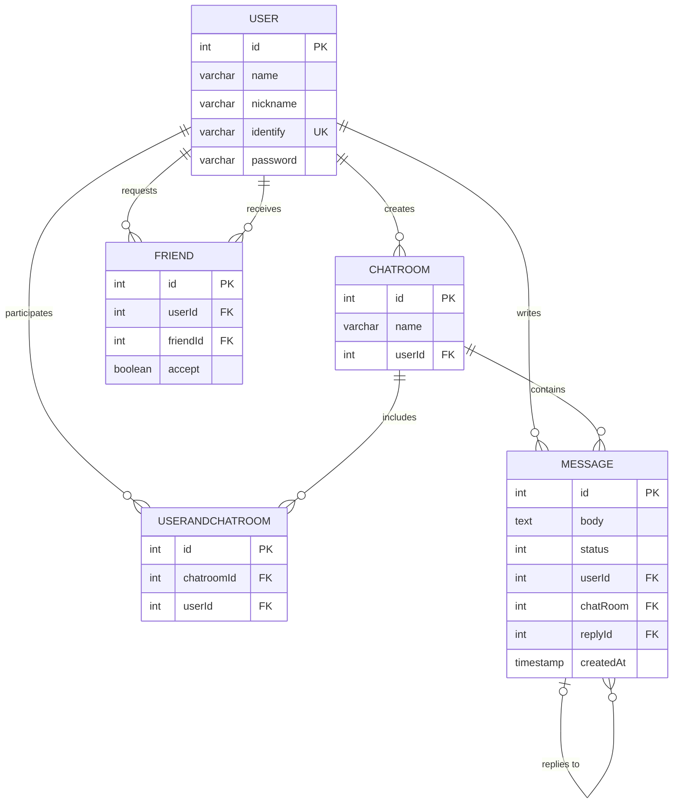

채팅 서비스를 구현해보는 연습용 프로젝트

특정 주제를 처음부터 끝까지 백엔드 관점에서 기획해보는 것이 목표이다.

기본 구조는 node로 구현한 경험이 있기 때문에 이번에는 보안을 중점적으로 다룰 생각이다.

# 요구기능 정의
- 회원가입
- 로그인
- 정보 변경
- 채팅방 생성
- 채팅방 수정
- 채팅방 삭제
- 채팅 기능
- 답장 기능(status로 확인)
- 이모지 or 그림 전달 기능
- 채팅방 검색 기능
## 추가 해보면 재밌을 것 같은 기능
- excalidraw에서 web에서 링크 공유해서 서로 연동하는 기능
# DB 정의

#   API 명세

docs/api.md 참고

# 기술 스택
- springboot
- mysql
- gradle
- docker(사용하고 싶다...)